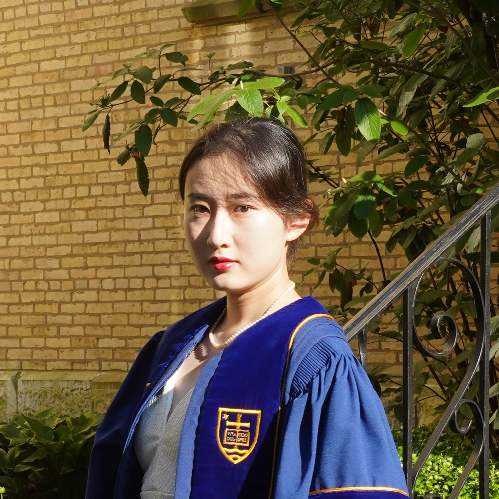
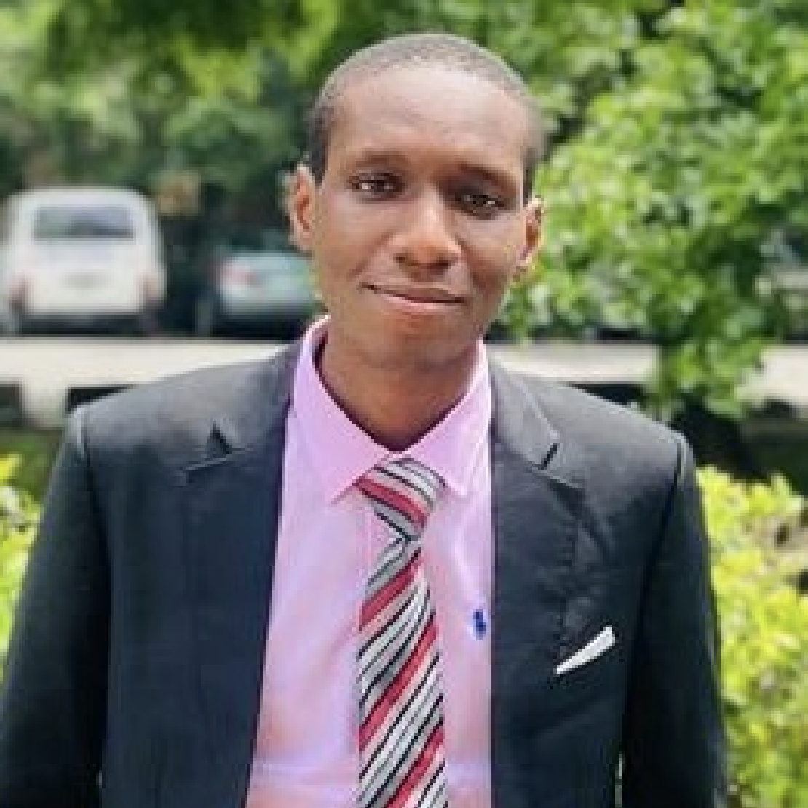
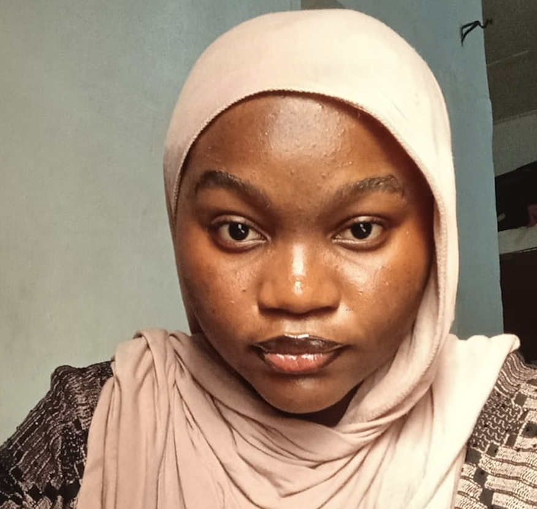

## Principal Investigator
<table>
  <tr>
    <td style="width: 160px; vertical-align: top;">
      
    </td>
    <td style="vertical-align: top; padding-left: 20px;">
      <strong>Dr. Ning Wang</strong> 
      Assistant Professor, Department of Chemical Engineering, UT Tyler 
      Editorial Board Member, Journal of Ionic Liquids  
      Ph.D. in Chemical Engineering, University of Notre Dame 
      M.S.E. in Materials Science and Engineering, University of Pennsylvania 
      B.E. in Polymer Materials and Engineering, Beijing University of Chemical Technology 
      Expertise: Molecular modeling and simulations, free energy calculations, AI/ML techniques, and force field development
    </td>
  </tr>
</table>

## Postdoctoral Researcher
<table>
  <tr>
    <td style="width: 160px; vertical-align: top;">
      
    </td>
    <td style="vertical-align: top; padding-left: 20px;">
      <strong>Could this be you?</strong> 
      We are looking for a highly motivated postdoctoral researcher to join the CoMMA Lab. 
      More details can be found <a href="{{ '/positions/' | relative_url }}">here</a>.
    </td>
  </tr>
</table>

## Graduate Researcher
<table>
  <tr>
    <td style="width: 160px; vertical-align: top;">
      
    </td>
    <td style="vertical-align: top; padding-left: 20px;">
      <strong>Babangida Abdulkadri Abdullahi</strong> 
      Babangida is a graduate research assistant at CoMMA Laboratory, with an interest in advancing sustainable materials and energy through artificial intelligence, computer modelling and simulations.
    </td>
  </tr>
</table>

## Undergraduate Researcher 
<table>
  <tr>
    <td style="width: 160px; vertical-align: top;">
      
    </td>
    <td style="vertical-align: top; padding-left: 20px;">
      <strong>Zainab Tairu</strong> 
      Zainab is an undergraduate Chemical Engineering student at Obafemi Awolowo University, Nigeria, and an NLP engineer with experience applying machine learning to real-world problems. Her research interests span protein engineering, molecular simulation, and sustainable materials. At the CoMMA Lab, she is eager to explore AI-guided modeling techniques to accelerate discovery and deepen her computational research skills.
    </td>
  </tr>
</table>

<!-- Add more members here -->
