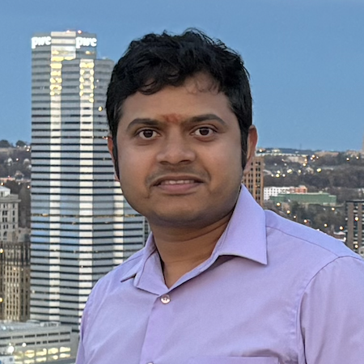
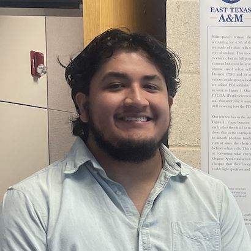

## Principal Investigator
<table>
  <tr>
    <td style="width: 160px; vertical-align: top;">
      
    </td>
    <td style="vertical-align: top; padding-left: 20px;">
      <strong>Dr. Ning Wang</strong> 
      Assistant Professor, Department of Chemical Engineering, UT Tyler 
      Editorial Board Member, Journal of Ionic Liquids  
      Ph.D. in Chemical Engineering, University of Notre Dame 
      M.S.E. in Materials Science and Engineering, University of Pennsylvania 
      B.E. in Polymer Materials and Engineering, Beijing University of Chemical Technology 
      Expertise: Molecular modeling and simulations, free energy calculations, AI/ML techniques, and force field development
    </td>
  </tr>
</table>

## Postdoctoral Researcher
<table>
  <tr>
    <td style="width: 160px; vertical-align: top;">
      
    </td>
    <td style="vertical-align: top; padding-left: 20px;">
      <strong>Dr. Manish Maurya</strong> 
      Manish is a computational researcher interested in molecular modeling and simulations of polymers, porous materials, and electrochemical interfaces for carbon capture and electrocatalysis. His work combines molecular dynamics, Monte Carlo, and DFT methods to understand the structure, dynamics, and reactivity at solid-liquid interfaces. During his PhD, he studied carbon-based materials for CO₂ capture, and in his postdoctoral research, he explored confined water behavior, polymer-ionic liquid interactions, and electrode microenvironments for CO electroreduction. His goal is to develop molecular-level insights that can guide the design of efficient materials for sustainable energy and environmental technologies.      
    </td>
  </tr>
</table>

## Graduate Researcher
<table>
  <tr>
    <td style="width: 160px; vertical-align: top;">
      
    </td>
    <td style="vertical-align: top; padding-left: 20px;">
      <strong>Could this be you?</strong> 
      Are you interested in joining the CoMMA Lab as a graduate researcher?  
      We are looking for motivated students! Learn more <a href="/positions/">here</a>.
    </td>
  </tr>
</table>

## Undergraduate Researcher 
<table>
  <tr>
    <td style="width: 160px; vertical-align: top;">
      
    </td>
    <td style="vertical-align: top; padding-left: 20px;">
      <strong>David Mancilla</strong> 
      David is a sophomore majoring in Chemical Engineering at the University of Texas at Tyler. His research interests lie at the intersection of computational and applied science, with a focus on molecular simulations and machine learning techniques-especially as they relate to organic synthesis. His goal is to help translate these advanced computational tools into practical solutions for pharmaceutical and medical applications. By leveraging molecular modeling to design novel compounds and applying Al to accelerate discovery, he's excited to contribute to the lab's mission of advancing sustainable and impactful chemical engineering research.
    </td>
  </tr>

  <tr>
    <td style="width: 160px; vertical-align: top;">
      
    </td>
    <td style="vertical-align: top; padding-left: 20px;">
      <strong>Zainab Tairu</strong> 
      Zainab is an undergraduate Chemical Engineering student at Obafemi Awolowo University, Nigeria, and an NLP engineer with experience applying machine learning to real-world problems. Her research interests span protein engineering, molecular simulation, and sustainable materials. At the CoMMA Lab, she is eager to explore AI-guided modeling techniques to accelerate discovery and deepen her computational research skills.
    </td>
  </tr>
</table>

<!-- Add more members here -->
